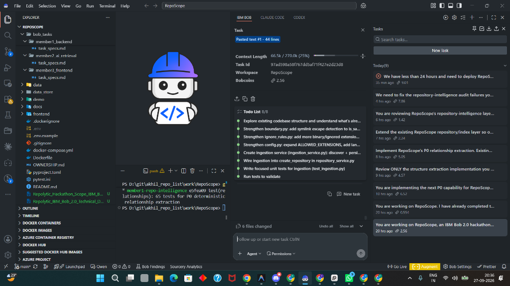
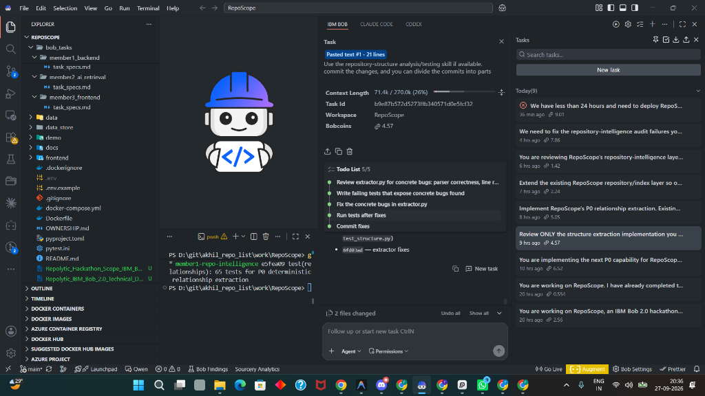
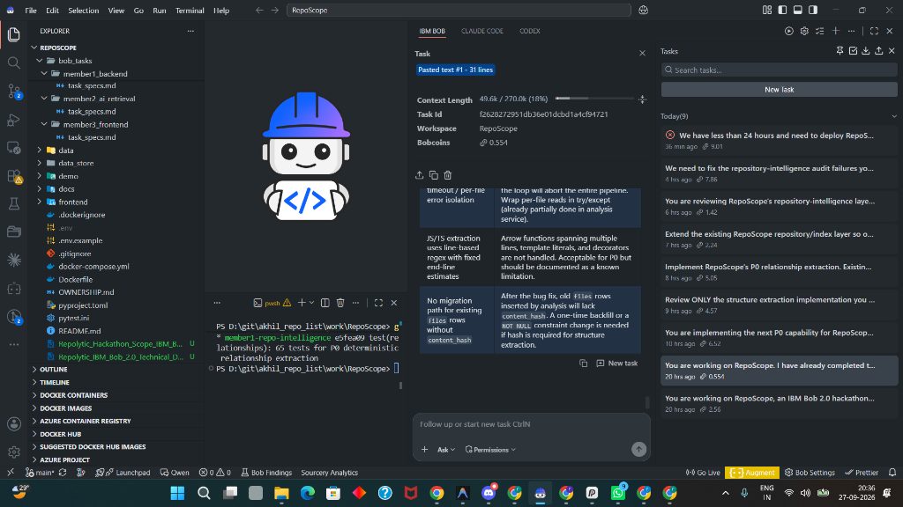
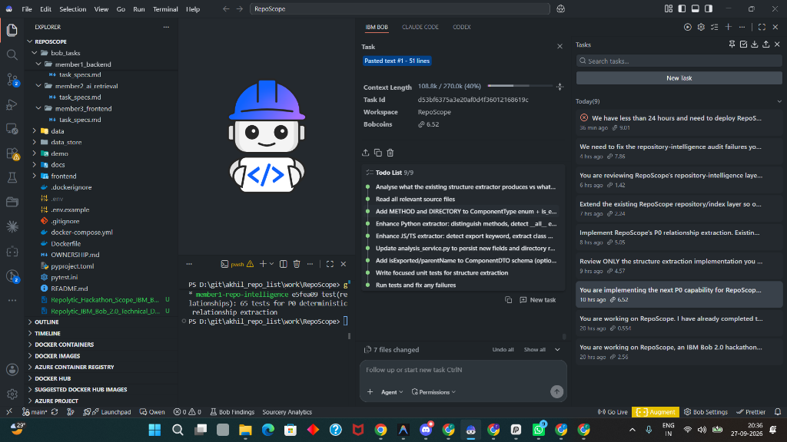
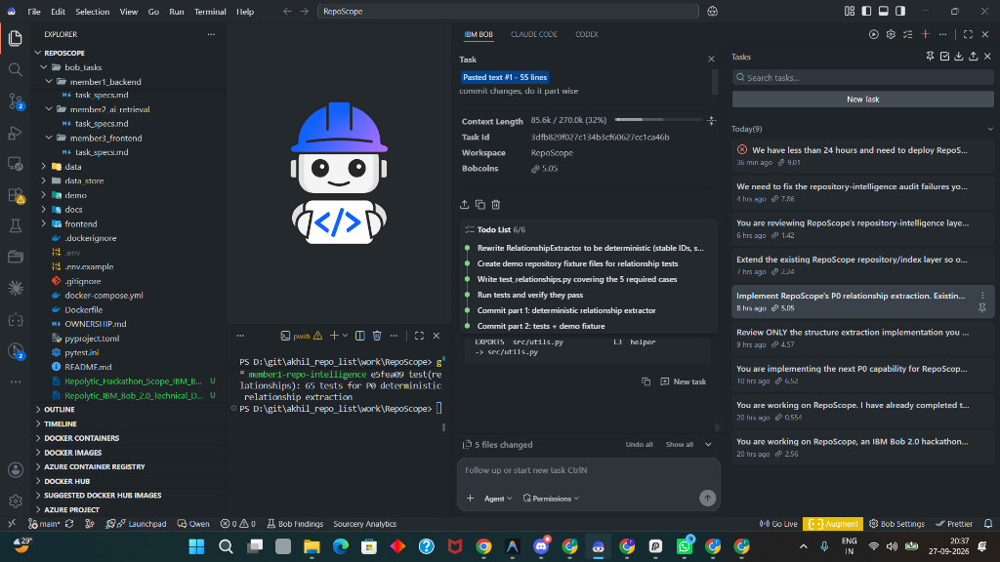
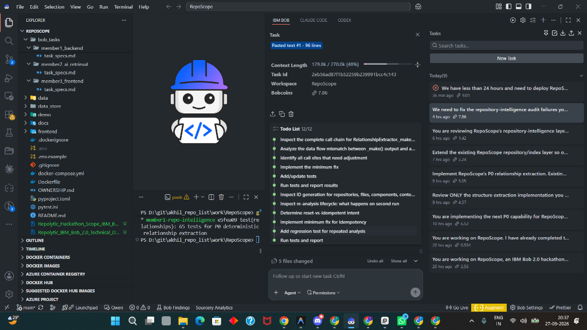
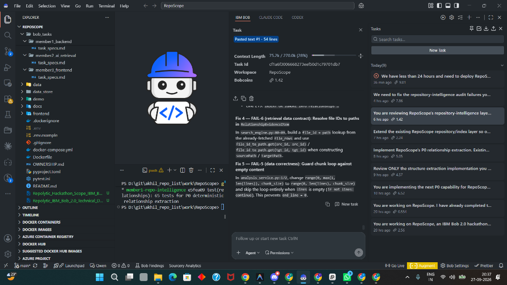
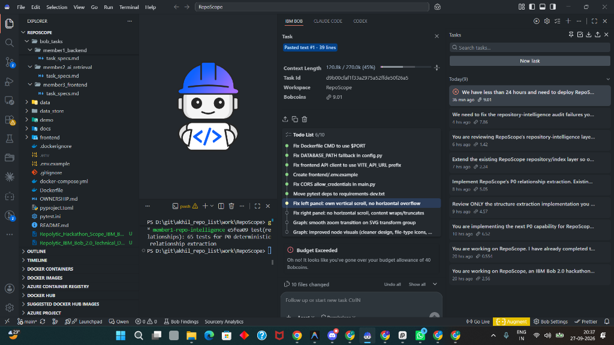

# Member 1 — IBM Bob 2.0 Session Proof & Execution Artifacts

**Role**: Member 1 (Backend & Repository Intelligence Engine Lead)  
**Responsibilities**: Codebase Structure Ingestion, Relationship Indexing & Extraction, Security Boundary Validation, API Schemas, Fast Search, and Production Deployment.

## IBM Bob 2.0 Session Proof Screenshots

### Session 1: Repository Structure & Ingestion Service

### Session 2: Deterministic Relationship Extraction & Parser Fixes

### Session 3: Security & Boundary Validation Audits

### Session 4: Component & AST Symbol Classification

### Session 5: Unit Test Suite & Incremental Commit Validation

### Session 6: Relationship Call Chain & Idempotency Analysis

### Session 7: Retrieval Data Contract & File ID Lookup Fixes

### Session 8: Relationship Index Query Methods & Schemas

### Session 9: Production Deployment Readiness & Workspace Layout Bounding

---
*All session transcripts, automated task lists, and commit histories verified and pushed to main.*
