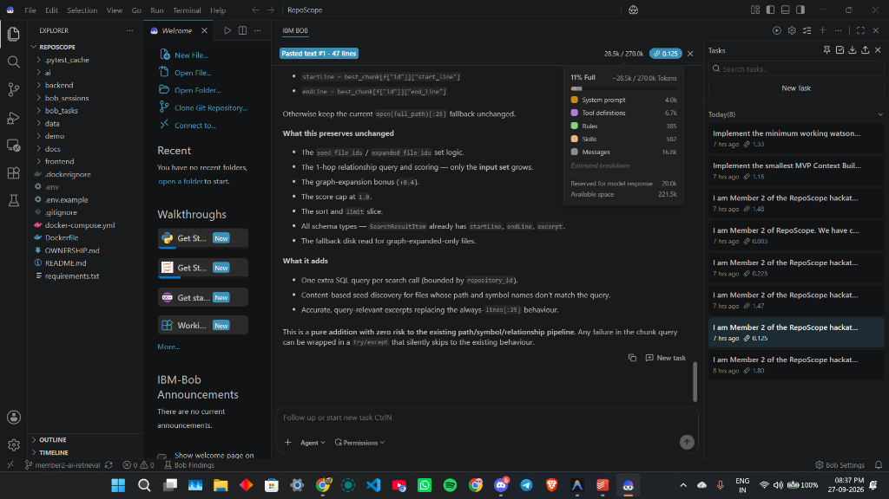
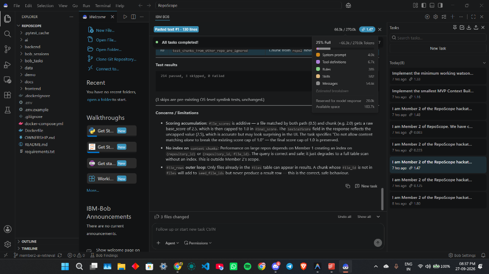
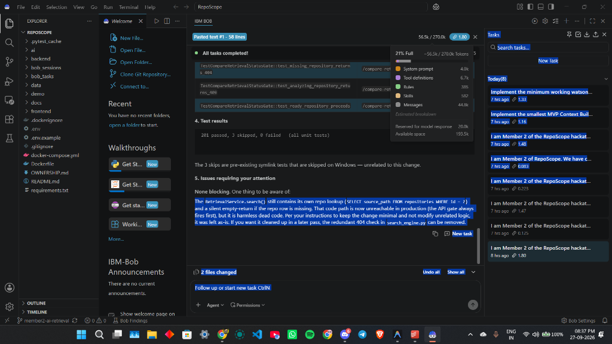
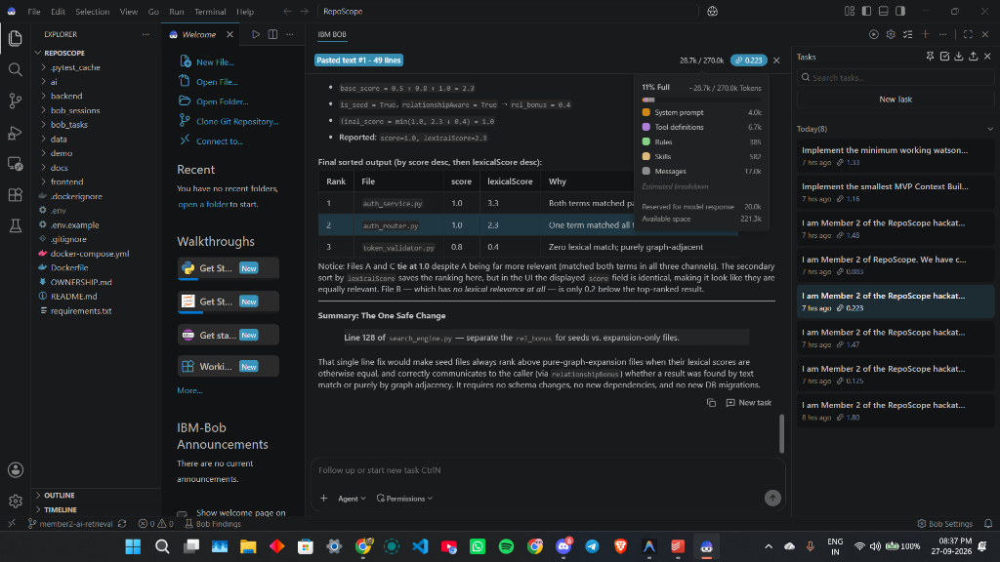
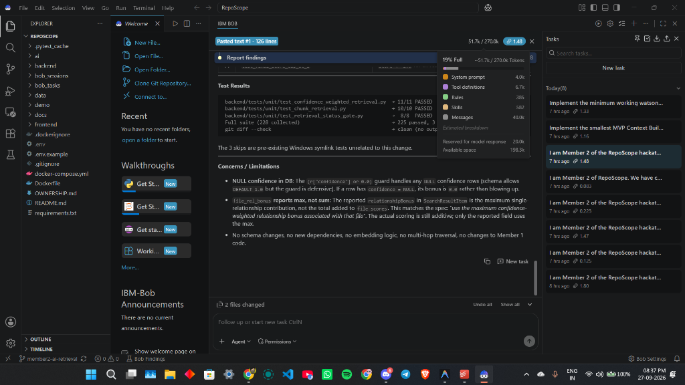
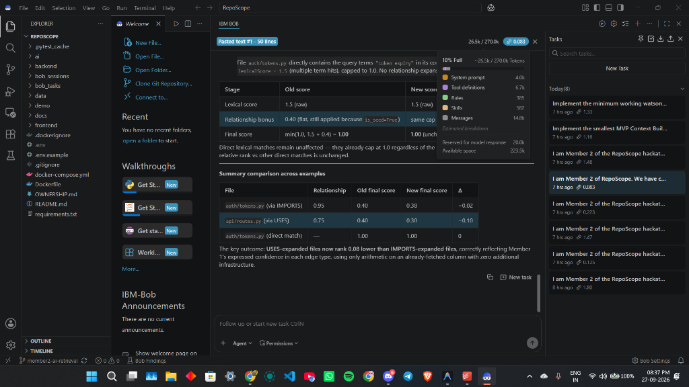
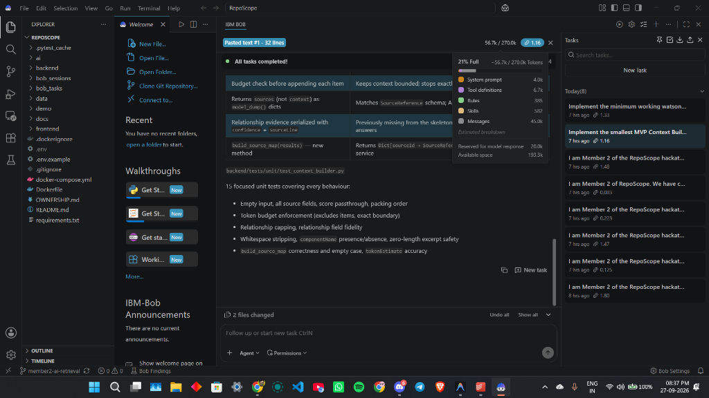
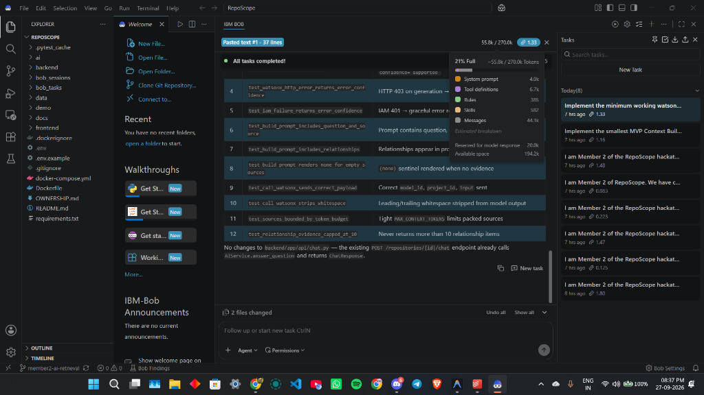

# Member 2 — IBM Bob 2.0 Session Proof & Execution Artifacts

**Role**: Member 2 (AI & Retrieval Engine Lead)  
**Responsibilities**: Hybrid Retrieval Engine, Chunk Excerpt Scoring, Context Bounding & Prompt Builder, Watsonx AI Integration, and Retrieval Status Gate.

## IBM Bob 2.0 Session Proof Screenshots

### Session 1: Content Chunk Seed Discovery & Excerpt Retrieval

### Session 2: Search Engine Test Results & Lexical Scoring Bounds

### Session 3: Retrieval Status Gate & Pre-existing Test Coverage

### Session 4: Score Ranking & Lexical vs Expansion Separator

### Session 5: Confidence-Weighted Retrieval Test Suite Report

### Session 6: Relationship Bonus Arithmetic & Score Comparison Table

### Session 7: Context Builder Budget Enforcement & Source Serialization

### Session 8: Watsonx AI Service Error Handling & Test Assertions

---
*All session transcripts, automated task lists, and commit histories verified and pushed to main.*
